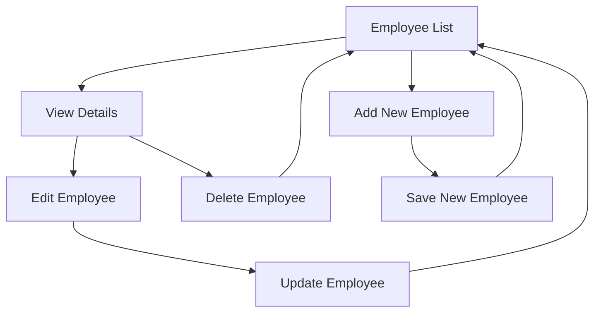
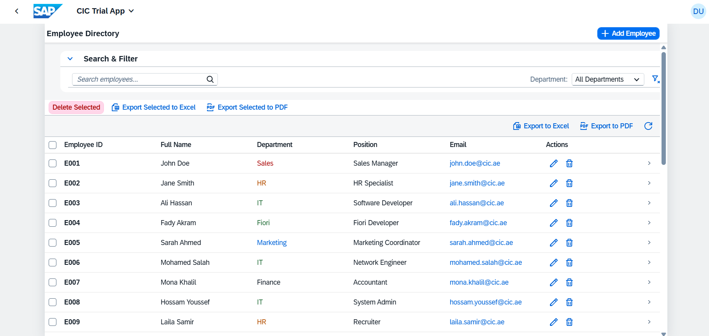
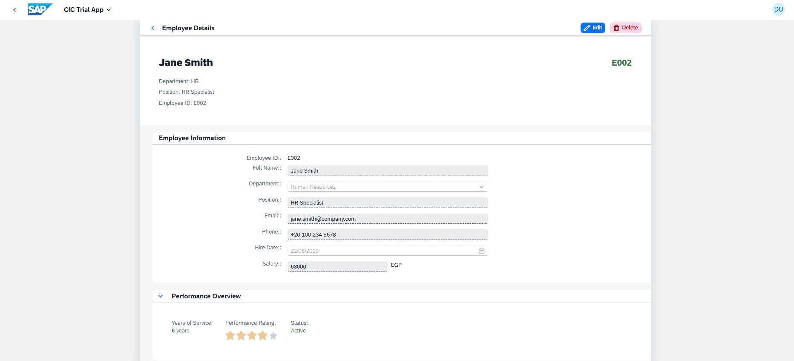
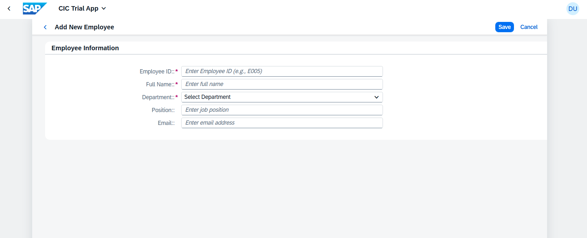
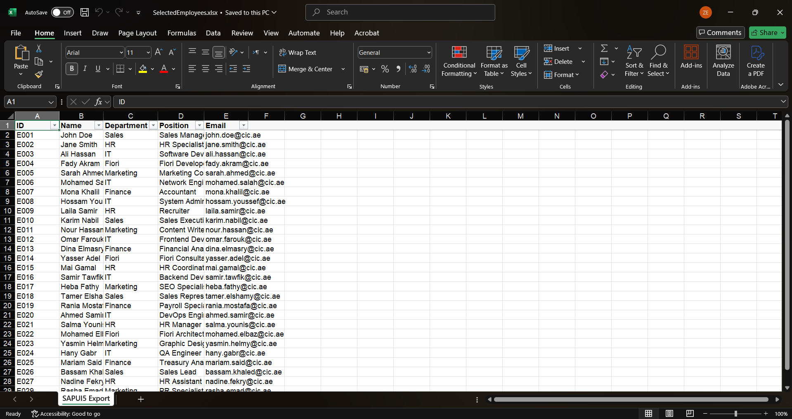
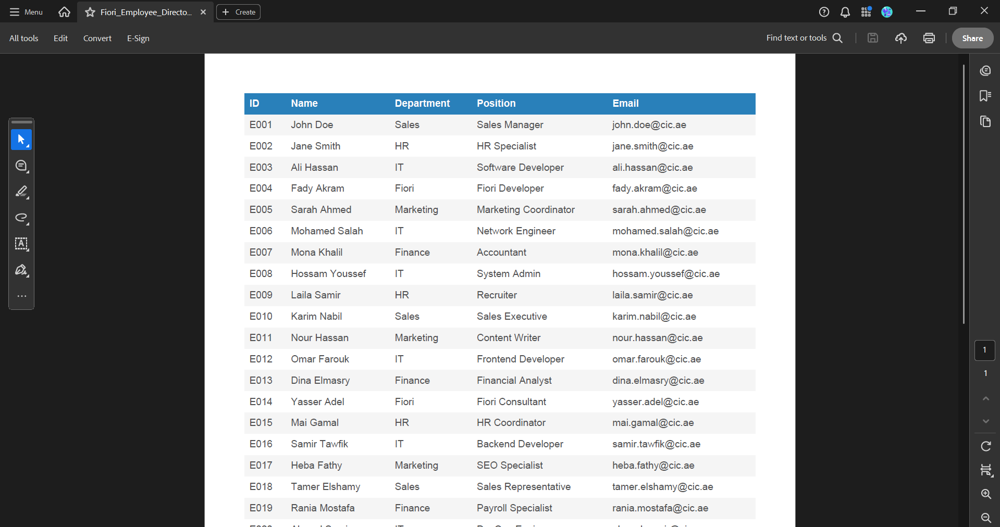

# SAP Fiori Employee Directory

🏢 **Enterprise Employee Management System** built with SAP UI5/Fiori

[](https://ui5.sap.com/)
[](https://experience.sap.com/fiori/)
[](LICENSE)

## 📋 Overview

A comprehensive employee directory application showcasing modern SAP Fiori development practices. This application demonstrates end-to-end CRUD operations, responsive design, and adherence to SAP Fiori design guidelines.

### ✨ Key Features

- **📊 Employee Management**: Complete CRUD operations (Create, Read, Update, Delete)
- **🔍 Smart Search & Filtering**: Real-time search across employee data
- **📱 Responsive Design**: Optimized for desktop, tablet, and mobile devices
- **✅ Form Validation**: Client-side validation with user-friendly error handling
- **🎨 Modern UI**: Follows SAP Fiori 3.0 design principles
- **🌐 Internationalization**: i18n support for multiple languages
- **📈 Performance Optimized**: Efficient data binding and rendering

## 🛠️ Technology Stack

| Component        | Technology                                |
| ---------------- | ----------------------------------------- |
| **Framework**    | SAP UI5 1.139+                            |
| **Architecture** | Model-View-Controller (MVC)               |
| **Data Binding** | Two-way data binding                      |
| **Routing**      | SAP UI5 Router                            |
| **Styling**      | SAP Fiori 3.0 Theme                       |
| **Data Layer**   | JSON Model (Mock) → OData V2 (Production) |

## 📱 Application Flow



## 🚀 Getting Started

### Prerequisites

- Node.js (v16 or higher)
- SAP UI5 CLI
- Modern web browser

### Installation & Setup

1. **Clone the repository**

   ```bash
   git clone https://github.com/ziadsharara/cic-employee-management-system.git
   cd cic-employee-management-system
   ```

2. **Install dependencies**

   ```bash
   npm install
   ```

3. **Start development server**

   ```bash
   npm run serve
   ```

4. **Access the application**
   - Open browser: `http://localhost:8080`

## 🏗️ Project Structure

```
webapp/
├── controller/          # MVC Controllers
│   ├── App.controller.js
│   ├── EmployeeList.controller.js
│   ├── EmployeeDetail.controller.js
│   └── EmployeeCreate.controller.js
├── view/               # XML Views
│   ├── App.view.xml
│   ├── EmployeeList.view.xml
│   ├── EmployeeDetail.view.xml
│   └── EmployeeCreate.view.xml
├── model/              # Business Logic & Models
│   ├── models.js
├── i18n/               # Internationalization
│   └── i18n.properties
├── css/                # Custom Styles
│   └── style.css
├── manifest.json       # App Descriptor
├── Component.js        # Component Controller
├── index.html          # Entry Point
├── ui5.yaml            # UI5 Tooling Config
├── ui5-local.yaml      # Local UI5 Tooling Config
├── package.json        # NPM Config
└── README.md           # Project Documentation
```

## 🎯 Business Features

### Employee Management

- ✅ **List View**: Paginated table with search capabilities
- ✅ **Detail View**: Comprehensive employee information display
- ✅ **Create**: Form-based employee creation with validation
- ✅ **Edit**: In-place editing with data persistence
- ✅ **Delete**: Confirmation-based deletion with undo capability

### Data Validation

- Required field validation
- Email format validation
- Duplicate ID prevention
- Real-time validation feedback

## 🔧 Development Guidelines

### Code Quality Standards

- ESLint and Prettier for code consistency
- JSDoc comments for all functions and classes
- Strict MVC separation: controllers, views, models
- Reusable UI components and utility functions
- Unit and integration tests for all business logic

### SAP Fiori Compliance

- Responsive layouts for desktop, tablet, and mobile
- Accessibility (WCAG 2.1) and keyboard navigation
- Performance optimizations (lazy loading, efficient binding)
- Consistent Fiori 3.0 design and theming
- Internationalization (i18n) for all user-facing text

## 📊 Screenshots

| Feature                | Screenshot                                           |
| ---------------------- | ---------------------------------------------------- |
| Employee List          |      |
| Employee Details       |  |
| Create Employee        |  |
| Exported Data to Excel |                  |
| Exported Data to PDF   |                      |

## 🔄 Development Roadmap

### Phase 1: Core Features ✅

- [x] Employee CRUD operations (list, view, create, edit, delete)
- [x] Responsive UI and Fiori 3.0 theming
- [x] Form validation and error handling
- [x] Routing and navigation setup

### Phase 2: Enhanced Features 🚧

- [x] Export to Excel/PDF (Implemented: EmployeeList table can be exported to Excel and PDF)
- [x] Bulk employee operations
- [x] Table pagination and sorting

### Phase 3: Enterprise Features 📋

- [ ] OData V4 backend integration
- [ ] Role-based access control
- [ ] Audit trail and change history
- [ ] SAP SuccessFactors integration

## 👨‍💻 Author

**CIC Fiori Team** - _SAP Fiori Developers_

- LinkedIn: [Linkedin Profile](https://www.linkedin.com/in/ziadsharara/)
- Email: ziad.shararaa@gmail.com

## 🙏 Acknowledgments

- SAP UI5 Team for the excellent framework
- SAP Fiori Design Guidelines
- Open source community

---

⭐ **If this project helped you, please give it a star!** ⭐
