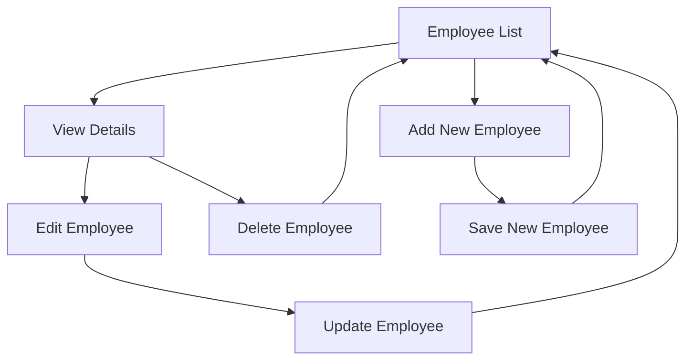
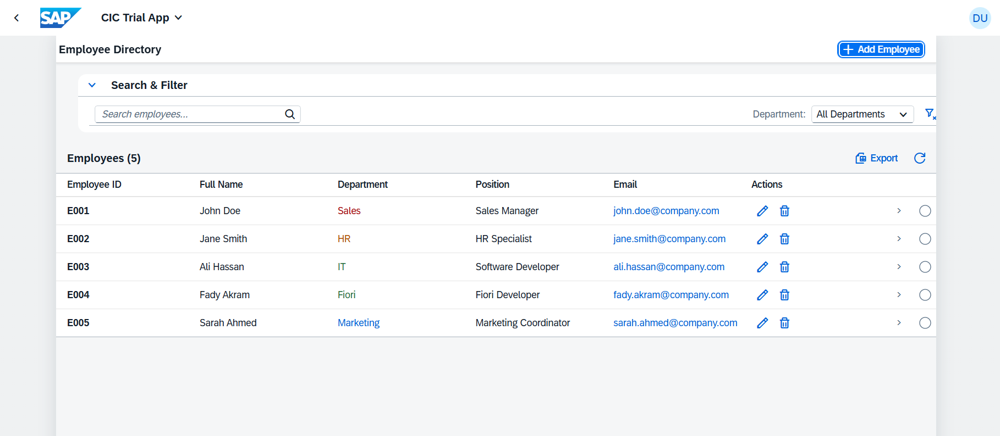

# SAP Fiori Employee Directory

🏢 **Enterprise Employee Management System** built with SAP UI5/Fiori

[](https://ui5.sap.com/)
[](https://experience.sap.com/fiori/)
[](LICENSE)

## 📋 Overview

A comprehensive employee directory application showcasing modern SAP Fiori development practices. This application demonstrates end-to-end CRUD operations, responsive design, and adherence to SAP Fiori design guidelines.

### ✨ Key Features

- **📊 Employee Management**: Complete CRUD operations (Create, Read, Update, Delete)
- **🔍 Smart Search & Filtering**: Real-time search across employee data
- **📱 Responsive Design**: Optimized for desktop, tablet, and mobile devices
- **✅ Form Validation**: Client-side validation with user-friendly error handling
- **🎨 Modern UI**: Follows SAP Fiori 3.0 design principles
- **🌐 Internationalization**: i18n support for multiple languages
- **📈 Performance Optimized**: Efficient data binding and rendering

## 🛠️ Technology Stack

| Component | Technology |
|-----------|------------|
| **Framework** | SAP UI5 1.139+ |
| **Architecture** | Model-View-Controller (MVC) |
| **Data Binding** | Two-way data binding |
| **Routing** | SAP UI5 Router |
| **Styling** | SAP Fiori 3.0 Theme |
| **Data Layer** | JSON Model (Mock) → OData V2 (Production) |

## 🚀 Getting Started

### Prerequisites
- Node.js (v16 or higher)
- SAP UI5 CLI
- Modern web browser

### Installation & Setup

1. **Clone the repository**
   ```bash
   git clone https://github.com/[username]/sap-fiori-employee-directory.git
   cd sap-fiori-employee-directory
   ```

2. **Install dependencies**
   ```bash
   npm install
   ```

3. **Start development server**
   ```bash
   npm start
   # or
   ui5 serve --open
   ```

4. **Access the application**
   - Open browser: `http://localhost:8080`

## 📱 Application Flow



## 🏗️ Project Structure

```
webapp/
├── 📁 controller/          # MVC Controllers
│   ├── App.controller.js
│   ├── EmployeeList.controller.js
│   ├── EmployeeDetail.controller.js
│   └── EmployeeCreate.controller.js
├── 📁 view/               # XML Views
│   ├── App.view.xml
│   ├── EmployeeList.view.xml
│   ├── EmployeeDetail.view.xml
│   └── EmployeeCreate.view.xml
├── 📁 model/              # Business Logic & Models
│   ├── models.js
│   └── formatter.js
├── 📁 i18n/               # Internationalization
│   └── i18n.properties
├── 📁 localService/       # Mock Data (Development)
│   ├── metadata.xml
│   └── mockdata/
├── 📄 Component.js        # Component Controller
├── 📄 manifest.json       # App Descriptor
└── 📄 index.html          # Entry Point
```

## 🎯 Business Features

### Employee Management
- ✅ **List View**: Paginated table with search capabilities
- ✅ **Detail View**: Comprehensive employee information display
- ✅ **Create**: Form-based employee creation with validation
- ✅ **Edit**: In-place editing with data persistence
- ✅ **Delete**: Confirmation-based deletion with undo capability

### Data Validation
- Required field validation
- Email format validation
- Duplicate ID prevention
- Real-time validation feedback

## 🔧 Development Guidelines

### Code Quality Standards
- ESLint configuration for code consistency
- JSDoc comments for all functions
- Separation of concerns (MVC pattern)
- Reusable components and utilities

### SAP Fiori Compliance
- Responsive breakpoints
- Accessibility (WCAG 2.1)
- Performance optimizations
- Design consistency

## 📊 Screenshots

| Feature | Screenshot |
|---------|------------|
| Employee List |  |
| Employee Details |  |
| Create Employee |  |

## 🔄 Development Roadmap

### Phase 1: Core Features ✅
- [x] Basic CRUD operations
- [x] Responsive UI
- [x] Form validation
- [x] Routing setup

### Phase 2: Enhanced Features 🚧
- [ ] Advanced search and filters
- [ ] Export functionality (Excel/PDF)
- [ ] Bulk operations
- [ ] Employee photo management

### Phase 3: Enterprise Features 📋
- [ ] OData V4 integration
- [ ] Role-based access control
- [ ] Audit trail
- [ ] Integration with SAP SuccessFactors

## 🧪 Testing

```bash
# Run unit tests
npm test

# Run integration tests
npm run test:integration

# Generate coverage report
npm run test:coverage
```

## 🚀 Deployment

### Development Environment
```bash
npm run build:dev
```

### Production Build
```bash
npm run build:prod
```

### SAP Launchpad Integration
```bash
npm run deploy:launchpad
```

## 📈 Performance Metrics

- **Initial Load**: < 2 seconds
- **List Rendering**: < 500ms (1000 records)
- **Form Validation**: Real-time (< 100ms)
- **Bundle Size**: < 500KB (gzipped)

## 🤝 Contributing

1. Fork the repository
2. Create feature branch (`git checkout -b feature/amazing-feature`)
3. Commit changes (`git commit -m 'Add amazing feature'`)
4. Push to branch (`git push origin feature/amazing-feature`)
5. Open Pull Request

## 📄 License

This project is licensed under the MIT License - see the [LICENSE](LICENSE) file for details.

## 👨‍💻 Author

**[Your Name]** - *SAP Fiori Developer*
- LinkedIn: [Your Profile]
- Email: your.email@company.com

## 🙏 Acknowledgments

- SAP UI5 Team for the excellent framework
- SAP Fiori Design Guidelines
- Open source community

---

⭐ **If this project helped you, please give it a star!** ⭐
